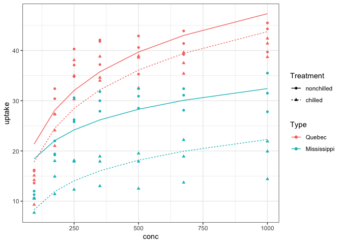

Modelling Approaches, Example 1
================
J. Zeldin
September 14, 2018

### Demonstrating Some Modeling Approaches Using CO2 uptake data from grassland plant species

``` r
library(tidyverse);library(lme4)
```

#### Overview

In this module, we will use the built in dataset “CO2” to demonstrate
some modeling approaches.

This data set consists of observations from six plants from Quebec and 6
from Mississippi. Half of the plants from each provenance were subjected
to a chilling treatment. Each plants CO2 uptake rate was measured at 7
different CO2 concentrations.

We might be interested in understanding if the chilling treatment and/or
CO2 concentration influences CO2 uptake rate. Let’s explore the data and
try some modeling approaches to understand what is happening in the
experiment.

#### Data Exploration

First let’s explore the data using some visualization techniques and
summary statistics.

``` r
# The distribution of our response variable
CO2 %>%
  ggplot(aes(uptake))+
  geom_histogram(bins = 15, color = "black")
```

<!-- -->

``` r
  # Not quite normally distributed... almost bimodal. Let's include some     other independant variables 
CO2 %>%
  ggplot(aes(uptake, fill = Treatment))+
  geom_histogram(position = "identity",alpha = 0.5,
                 bins = 15, color = "black")+
  scale_fill_brewer(palette = "Dark2")
```

<!-- -->

``` r
CO2 %>%
  ggplot(aes(uptake, fill = Type))+
  geom_histogram(position = "identity",alpha = 0.5,
                 bins = 15, color = "black")+
  scale_fill_brewer(palette = "Set3")
```

<!-- -->

``` r
  # The plant origin may be driving the bimodal distribution

# Visualize the relationship b/w concentration and uptake
CO2 %>%
  ggplot(aes(conc,uptake))+
  geom_point()
```

<!-- -->

``` r
# Add independant variables
CO2 %>%
  ggplot(aes(conc,uptake, color = Treatment))+
  geom_point()+
  scale_color_brewer(palette = "Dark2")
```

<!-- -->

``` r
CO2 %>%
  ggplot(aes(conc,uptake, color = Type))+
  geom_point()+
  scale_color_brewer(palette = "Set2")
```

<!-- -->

``` r
CO2 %>%
  ggplot(aes(conc,uptake, shape = Type, color = Treatment))+
  geom_point()+
  scale_color_brewer(palette = "Set2")
```

<!-- -->
There appears to be an exponential relationship b/w concentration and
uptake. There is also a pretty clear additive effect of plant origin.

Let’s building some models. We will start with a simple linear
regression of uptake ~ conentration

``` r
lm_1 <- lm(uptake ~ conc, data = CO2)
summary(lm_1)
```

    ## 
    ## Call:
    ## lm(formula = uptake ~ conc, data = CO2)
    ## 
    ## Residuals:
    ##     Min      1Q  Median      3Q     Max 
    ## -22.831  -7.729   1.483   7.748  16.394 
    ## 
    ## Coefficients:
    ##              Estimate Std. Error t value Pr(>|t|)    
    ## (Intercept) 19.500290   1.853080  10.523  < 2e-16 ***
    ## conc         0.017731   0.003529   5.024 2.91e-06 ***
    ## ---
    ## Signif. codes:  0 '***' 0.001 '**' 0.01 '*' 0.05 '.' 0.1 ' ' 1
    ## 
    ## Residual standard error: 9.514 on 82 degrees of freedom
    ## Multiple R-squared:  0.2354, Adjusted R-squared:  0.2261 
    ## F-statistic: 25.25 on 1 and 82 DF,  p-value: 2.906e-06

The summary output gives us a very significant p-value for the
concentration term as well as for the F test of the overall model and
the adjusted R2 is 0.23. There is quite a bit of unexplained variation
in our data in this case. Let’s plot our model’s predictions and look at
the residuals.

``` r
library(broom)

lm_1 %>% 
  augment() %>% 
  ggplot(aes(conc,uptake))+
  geom_point()+
  geom_line(aes(conc,.fitted), color = "red")+
  theme_bw()
```

<!-- -->

``` r
par(mfrow=c(2,2))
plot(lm_1)
```

<!-- -->

``` r
par(mfrow=c(1,1))
```

From the plots above - it’s pretty clear that our model, while
significant, is not doing a good job of describing our data.

Originally, we saw that there was probably an exponential relationship
b/w concentraiton and uptake. Let’s fit an exponential model by
log-transofrming the response variable uptake

``` r
CO2 <- CO2 %>%
  mutate(log_conc = log(conc))

em_1 <- lm(uptake ~ log_conc, data = CO2)
summary(em_1)
```

    ## 
    ## Call:
    ## lm(formula = uptake ~ log_conc, data = CO2)
    ## 
    ## Residuals:
    ##      Min       1Q   Median       3Q      Max 
    ## -22.0474  -5.9024   0.3495   6.4662  15.6138 
    ## 
    ## Coefficients:
    ##             Estimate Std. Error t value Pr(>|t|)    
    ## (Intercept)  -22.157      7.475  -2.964  0.00397 ** 
    ## log_conc       8.484      1.274   6.659 2.92e-09 ***
    ## ---
    ## Signif. codes:  0 '***' 0.001 '**' 0.01 '*' 0.05 '.' 0.1 ' ' 1
    ## 
    ## Residual standard error: 8.765 on 82 degrees of freedom
    ## Multiple R-squared:  0.351,  Adjusted R-squared:  0.3431 
    ## F-statistic: 44.34 on 1 and 82 DF,  p-value: 2.915e-09

The summary tells a similar story, significant concentration term,
F-test, but now we have a higher adjusted R2 of 0.34. Let’s plot it out

``` r
em_1 %>% 
  augment(newdata = CO2) %>% 
  ggplot(aes(conc,uptake))+
  geom_point()+
  geom_line(aes(conc,.fitted), color = "red")+
  theme_bw()
```

<!-- -->

We have the same issues as our first model. This is because there is
more structure in our data that we have yet to address. We should fix
this.

One of the main goals of the study underlying the data was the effect of
the chilling treatment on CO2 uptake. As such, we should include it in
our model.

``` r
em_2 <- lm(uptake ~ log_conc*Treatment, data = CO2)
summary(em_2)
```

    ## 
    ## Call:
    ## lm(formula = uptake ~ log_conc * Treatment, data = CO2)
    ## 
    ## Residuals:
    ##     Min      1Q  Median      3Q     Max 
    ## -17.352  -6.009  -1.506   6.649  16.497 
    ## 
    ## Coefficients:
    ##                           Estimate Std. Error t value Pr(>|t|)    
    ## (Intercept)                -25.492      9.769  -2.610   0.0108 *  
    ## log_conc                     9.646      1.665   5.794  1.3e-07 ***
    ## Treatmentchilled             6.670     13.815   0.483   0.6305    
    ## log_conc:Treatmentchilled   -2.325      2.354  -0.987   0.3264    
    ## ---
    ## Signif. codes:  0 '***' 0.001 '**' 0.01 '*' 0.05 '.' 0.1 ' ' 1
    ## 
    ## Residual standard error: 8.099 on 80 degrees of freedom
    ## Multiple R-squared:  0.4594, Adjusted R-squared:  0.4391 
    ## F-statistic: 22.66 on 3 and 80 DF,  p-value: 1.026e-10

``` r
em_2 %>% 
  augment(newdata = CO2) %>% 
  ggplot(aes(conc,uptake, color = Treatment))+
  geom_point()+
  geom_line(aes(conc,.fitted))+
  theme_bw()
```

<!-- -->

This model gives us similar results as above, except now we have an
non-siginificant Treatment and Treatment x Concentration terms. Our
model is still not doing a great job of describing the data. Let’s see
if removing the non-significant interaction term improves the situation.

``` r
em_3 <- update(em_2, .~. - Treatment:log_conc)
summary(em_3)
```

    ## 
    ## Call:
    ## lm(formula = uptake ~ log_conc + Treatment, data = CO2)
    ## 
    ## Residuals:
    ##     Min      1Q  Median      3Q     Max 
    ## -18.618  -5.740  -1.284   6.624  16.843 
    ## 
    ## Coefficients:
    ##                  Estimate Std. Error t value Pr(>|t|)    
    ## (Intercept)       -18.727      6.963  -2.690 0.008683 ** 
    ## log_conc            8.484      1.177   7.208 2.67e-10 ***
    ## Treatmentchilled   -6.860      1.767  -3.882 0.000211 ***
    ## ---
    ## Signif. codes:  0 '***' 0.001 '**' 0.01 '*' 0.05 '.' 0.1 ' ' 1
    ## 
    ## Residual standard error: 8.098 on 81 degrees of freedom
    ## Multiple R-squared:  0.4528, Adjusted R-squared:  0.4393 
    ## F-statistic: 33.51 on 2 and 81 DF,  p-value: 2.488e-11

``` r
em_3 %>% 
  augment(newdata = CO2) %>% 
  ggplot(aes(conc,uptake, color = Treatment))+
  geom_point()+
  geom_line(aes(conc,.fitted))+
  theme_bw()
```

<!-- -->
Now the Treatment effect is significant in the model summary. However,
the model is still not describing the data well. The residuals appear to
be large

Now is a good time to note that the modelling process above is not in
the most appropriate order. Generally, you will want to start by
building a model that includes all of relevant terms and work backwards,
removing terms that don’t contribute to the model’s ability to describe
the data.

So now that we know more about the modelling process, let’s build a more
extensive model including all of our relevant independant variables:
Concentration, Treatment, and Type (plant origin). We won’t include the
Concentration x Treatment interaction, as it was suggested by our
visualizations and was deemed unimportant in our earlier analyses. We
will then go through a basic model simplification procedure based on
likelihood ratio testing of models with each predictor
dropped.

``` r
model_1 <- lm(uptake ~ log_conc + Treatment + Type + log_conc:Type + Treatment:Type, data = CO2 )
summary(model_1)
```

    ## 
    ## Call:
    ## lm(formula = uptake ~ log_conc + Treatment + Type + log_conc:Type + 
    ##     Treatment:Type, data = CO2)
    ## 
    ## Residuals:
    ##     Min      1Q  Median      3Q     Max 
    ## -8.4974 -2.9076  0.1892  2.7548  9.6322 
    ## 
    ## Coefficients:
    ##                                  Estimate Std. Error t value Pr(>|t|)    
    ## (Intercept)                      -28.8414     5.1777  -5.570 3.49e-07 ***
    ## log_conc                          11.0279     0.8753  12.599  < 2e-16 ***
    ## Treatmentchilled                  -3.5810     1.3141  -2.725 0.007935 ** 
    ## TypeMississippi                   20.2281     7.3224   2.762 0.007151 ** 
    ## log_conc:TypeMississippi          -5.0881     1.2379  -4.110 9.69e-05 ***
    ## Treatmentchilled:TypeMississippi  -6.5571     1.8584  -3.528 0.000705 ***
    ## ---
    ## Signif. codes:  0 '***' 0.001 '**' 0.01 '*' 0.05 '.' 0.1 ' ' 1
    ## 
    ## Residual standard error: 4.258 on 78 degrees of freedom
    ## Multiple R-squared:  0.8543, Adjusted R-squared:  0.845 
    ## F-statistic: 91.47 on 5 and 78 DF,  p-value: < 2.2e-16

``` r
model_2 <- update(model_1, .~. - log_conc:Type)
anova(model_2,model_1) # p < 0.05, suggests term should be retained
```

    ## Analysis of Variance Table
    ## 
    ## Model 1: uptake ~ log_conc + Treatment + Type + Treatment:Type
    ## Model 2: uptake ~ log_conc + Treatment + Type + log_conc:Type + Treatment:Type
    ##   Res.Df    RSS Df Sum of Sq      F    Pr(>F)    
    ## 1     79 1720.7                                  
    ## 2     78 1414.3  1    306.35 16.895 9.687e-05 ***
    ## ---
    ## Signif. codes:  0 '***' 0.001 '**' 0.01 '*' 0.05 '.' 0.1 ' ' 1

``` r
model_3 <- update(model_1, .~. - Type:Treatment) # testing next interaction term
anova(model_3,model_1) # p < 0.05 suggests retaining term
```

    ## Analysis of Variance Table
    ## 
    ## Model 1: uptake ~ log_conc + Treatment + Type + log_conc:Type
    ## Model 2: uptake ~ log_conc + Treatment + Type + log_conc:Type + Treatment:Type
    ##   Res.Df    RSS Df Sum of Sq      F    Pr(>F)    
    ## 1     79 1640.1                                  
    ## 2     78 1414.3  1    225.73 12.449 0.0007046 ***
    ## ---
    ## Signif. codes:  0 '***' 0.001 '**' 0.01 '*' 0.05 '.' 0.1 ' ' 1

``` r
summary(model_2) # model 1 is our best model
```

    ## 
    ## Call:
    ## lm(formula = uptake ~ log_conc + Treatment + Type + Treatment:Type, 
    ##     data = CO2)
    ## 
    ## Residuals:
    ##      Min       1Q   Median       3Q      Max 
    ## -11.7166  -2.8960   0.5837   2.7621   8.8745 
    ## 
    ## Coefficients:
    ##                                  Estimate Std. Error t value Pr(>|t|)    
    ## (Intercept)                      -14.0369     4.0768  -3.443 0.000923 ***
    ## log_conc                           8.4839     0.6783  12.507  < 2e-16 ***
    ## Treatmentchilled                  -3.5810     1.4403  -2.486 0.015017 *  
    ## TypeMississippi                   -9.3810     1.4403  -6.513 6.26e-09 ***
    ## Treatmentchilled:TypeMississippi  -6.5571     2.0368  -3.219 0.001866 ** 
    ## ---
    ## Signif. codes:  0 '***' 0.001 '**' 0.01 '*' 0.05 '.' 0.1 ' ' 1
    ## 
    ## Residual standard error: 4.667 on 79 degrees of freedom
    ## Multiple R-squared:  0.8227, Adjusted R-squared:  0.8138 
    ## F-statistic: 91.67 on 4 and 79 DF,  p-value: < 2.2e-16

So our best model indicates that uptake is affected by concentration,
type (plant origin), treatment, and the interaction b/w treatment and
type and concentration and type. We didn’t really need to do the
individual LRTests because the p-values in the summary call is
equivalent to anovas() with individual terms dropped, but redundancy can
be good.

Note that the R2 went up to 0.81. This suggests the model is explaining
a lot more of the variation in the data.

Let’s visualize the model’s predictions

``` r
model_1 %>% 
  augment(newdata = CO2) %>% 
  ggplot(aes(conc,uptake, color = Type, shape = Treatment))+
  geom_point()+
  geom_line(aes(conc,.fitted, linetype = Treatment))+
  theme_bw()
```

<!-- -->
Looks like the model is doing a better job now. But its hard to
differentiate Treatment in this graph. Let’s facet by Treatment to make
it more readable. We ll also add std. error ribbons to visualize
uncertainty.

``` r
model_1 %>% 
  augment(newdata = CO2) %>% 
  ggplot(aes(conc,uptake, color = Type, shape = Treatment))+
  geom_point()+
  geom_ribbon(aes(conc,ymin = .fitted - .se.fit, ymax = .fitted + .se.fit,
                  group = Type),
              alpha = 0.2, color = NA)+
  geom_line(aes(conc,.fitted))+
  facet_grid(~Treatment)+
  theme_bw()
```

<!-- -->

Now we can more see what’s happening much clearer. The model suggests
that there is a positive exponential relationship b/w CO2 concentration
and CO2 uptake. Additionally, the chilling treatment had an additive
effect, reducing the rate of CO2 uptake. Plants from Quebec take up CO2
faster than those from Mississppi and the negative chilling effect
appears to be more pronounced in plants form Mississippi.

This is great\! However, there are an issue remaining… Because the data
has multiple observations for each plant, our observations are not
independant. This can invalidate our conclusions unless we address it.

The best way to address this non-independance is by using multi-level
AKA mixed-effect modeling. This approach allows us to include individual
plant identity as a random effect variable. The model will account for
the variation due to differences between individual plants and allow us
to account for the non-independance in our observations. It also lets us
generalize our findings more broadly across the population and not just
the specific plants in the experiment.

We will be using the lme4 package to fit the mixed-effect models. These
types of models can get complicated and there are assumptions that must
be met etc. We will touch on those but won’t linger to much more
brevity.

``` r
library(lme4);library(pbkrtest) # load the lme4 and pbkrtest and packages

# setup the model, same formula as above but also including plantID as a random effect w/ random intercept. We will use REML = T for now
lmm_1 <- lmer(uptake ~ log_conc + Treatment + Type + log_conc:Type + Treatment:Type + (1|Plant), data = CO2,REML = T )

summary(lmm_1)
```

    ## Linear mixed model fit by REML ['lmerMod']
    ## Formula: 
    ## uptake ~ log_conc + Treatment + Type + log_conc:Type + Treatment:Type +  
    ##     (1 | Plant)
    ##    Data: CO2
    ## 
    ## REML criterion at convergence: 463.2
    ## 
    ## Scaled residuals: 
    ##      Min       1Q   Median       3Q      Max 
    ## -2.24144 -0.70670  0.09881  0.65659  2.28327 
    ## 
    ## Random effects:
    ##  Groups   Name        Variance Std.Dev.
    ##  Plant    (Intercept)  2.741   1.656   
    ##  Residual             16.164   4.020   
    ## Number of obs: 84, groups:  Plant, 12
    ## 
    ## Fixed effects:
    ##                                  Estimate Std. Error t value
    ## (Intercept)                      -28.8414     4.9812  -5.790
    ## log_conc                          11.0279     0.8264  13.344
    ## Treatmentchilled                  -3.5810     1.8350  -1.952
    ## TypeMississippi                   20.2281     7.0445   2.871
    ## log_conc:TypeMississippi          -5.0881     1.1688  -4.353
    ## Treatmentchilled:TypeMississippi  -6.5571     2.5950  -2.527
    ## 
    ## Correlation of Fixed Effects:
    ##             (Intr) lg_cnc Trtmnt TypMss lg_:TM
    ## log_conc    -0.965                            
    ## Trtmntchlld -0.184  0.000                     
    ## TypeMsssspp -0.707  0.683  0.130              
    ## lg_cnc:TypM  0.683 -0.707  0.000 -0.965       
    ## Trtmntch:TM  0.130  0.000 -0.707 -0.184  0.000

The model output for the mixed-effect model looks similar to regular
linear models, but with some exceptions.

We now have a random effects section that gives us information about
variance components. In this case, the variance associated with the
random effect planID is 2.74 and the residual variance is 16.16. We can
calculate the intraclass correlation coefficent (ICC) also known as
heritability or repeatability. This is simply the variance of the random
effect divided by the sum of the random effect variance and the residual
variance:

``` r
vc <- as.data.frame(VarCorr(lmm_1)) # These are the model's variance components
vc
```

    ##        grp        var1 var2      vcov    sdcor
    ## 1    Plant (Intercept) <NA>  2.741366 1.655707
    ## 2 Residual        <NA> <NA> 16.164382 4.020495

``` r
icc <- vc[1,"vcov"]/(vc[1,"vcov"] + vc[2,"vcov"])
icc # ICC = 0.15
```

    ## [1] 0.1450017

The ICC = 0.15, meaning that PlantID is responsible for 15% of the
variance in the model.

We can either stop here and predict/validate the model - or - perform
model simplification as we did with the regular linear models. Let’s try
the latter
route

``` r
# First, we have to re-fit the model with ML (REML = F) in order to compare models with different fixed effect structures

lmm_1 <- lmer(uptake ~ log_conc + Treatment + Type + log_conc:Type + Treatment:Type + (1|Plant), data = CO2,REML = F)

summary(lmm_1)
```

    ## Linear mixed model fit by maximum likelihood  ['lmerMod']
    ## Formula: 
    ## uptake ~ log_conc + Treatment + Type + log_conc:Type + Treatment:Type +  
    ##     (1 | Plant)
    ##    Data: CO2
    ## 
    ##      AIC      BIC   logLik deviance df.resid 
    ##    490.6    510.1   -237.3    474.6       76 
    ## 
    ## Scaled residuals: 
    ##     Min      1Q  Median      3Q     Max 
    ## -2.2231 -0.7507  0.1467  0.6180  2.3597 
    ## 
    ## Random effects:
    ##  Groups   Name        Variance Std.Dev.
    ##  Plant    (Intercept)  1.122   1.059   
    ##  Residual             15.715   3.964   
    ## Number of obs: 84, groups:  Plant, 12
    ## 
    ## Fixed effects:
    ##                                  Estimate Std. Error t value
    ## (Intercept)                      -28.8414     4.8589  -5.936
    ## log_conc                          11.0279     0.8149  13.533
    ## Treatmentchilled                  -3.5810     1.4982  -2.390
    ## TypeMississippi                   20.2281     6.8715   2.944
    ## log_conc:TypeMississippi          -5.0881     1.1524  -4.415
    ## Treatmentchilled:TypeMississippi  -6.5571     2.1188  -3.095
    ## 
    ## Correlation of Fixed Effects:
    ##             (Intr) lg_cnc Trtmnt TypMss lg_:TM
    ## log_conc    -0.976                            
    ## Trtmntchlld -0.154  0.000                     
    ## TypeMsssspp -0.707  0.690  0.109              
    ## lg_cnc:TypM  0.690 -0.707  0.000 -0.976       
    ## Trtmntch:TM  0.109  0.000 -0.707 -0.154  0.000

``` r
# Now we can fit a model that drops the interaction term with the lowest absolute t-value

lmm_2 <- lmer(uptake ~ log_conc + Treatment + Type + log_conc:Type + (1|Plant), data = CO2,REML = F)

# a normal anova() call will use the Wald d.f for the LRTest
anova(lmm_2,lmm_1) 
```

    ## Data: CO2
    ## Models:
    ## lmm_2: uptake ~ log_conc + Treatment + Type + log_conc:Type + (1 | Plant)
    ## lmm_1: uptake ~ log_conc + Treatment + Type + log_conc:Type + Treatment:Type + 
    ## lmm_1:     (1 | Plant)
    ##       Df    AIC    BIC  logLik deviance  Chisq Chi Df Pr(>Chisq)   
    ## lmm_2  7 495.68 512.69 -240.84   481.68                            
    ## lmm_1  8 490.64 510.08 -237.32   474.64 7.0408      1   0.007967 **
    ## ---
    ## Signif. codes:  0 '***' 0.001 '**' 0.01 '*' 0.05 '.' 0.1 ' ' 1

``` r
# we can also use KRmodcomp() to use the K-Rogers d.f, a slighlty more conservative method
KRmodcomp(lmm_2,lmm_1)
```

    ## F-test with Kenward-Roger approximation; computing time: 0.08 sec.
    ## large : uptake ~ log_conc + Treatment + Type + (1 | Plant) + log_conc:Type + 
    ##     Treatment:Type
    ## small : uptake ~ log_conc + Treatment + Type + log_conc:Type + (1 | Plant)
    ##         stat    ndf    ddf F.scaling p.value  
    ## Ftest 6.3849 1.0000 8.0000         1 0.03543 *
    ## ---
    ## Signif. codes:  0 '***' 0.001 '**' 0.01 '*' 0.05 '.' 0.1 ' ' 1

``` r
# Both approaches retain the interaction.
# Now for the second interaction

lmm_3 <- lmer(uptake ~ log_conc + Treatment + Type + Treatment:Type + (1|Plant), data = CO2,REML = F)

anova(lmm_3,lmm_1)
```

    ## Data: CO2
    ## Models:
    ## lmm_3: uptake ~ log_conc + Treatment + Type + Treatment:Type + (1 | 
    ## lmm_3:     Plant)
    ## lmm_1: uptake ~ log_conc + Treatment + Type + log_conc:Type + Treatment:Type + 
    ## lmm_1:     (1 | Plant)
    ##       Df    AIC    BIC  logLik deviance  Chisq Chi Df Pr(>Chisq)    
    ## lmm_3  7 505.89 522.90 -245.94   491.89                             
    ## lmm_1  8 490.64 510.08 -237.32   474.64 17.251      1  3.274e-05 ***
    ## ---
    ## Signif. codes:  0 '***' 0.001 '**' 0.01 '*' 0.05 '.' 0.1 ' ' 1

``` r
KRmodcomp(lmm_3,lmm_1)
```

    ## F-test with Kenward-Roger approximation; computing time: 0.03 sec.
    ## large : uptake ~ log_conc + Treatment + Type + (1 | Plant) + log_conc:Type + 
    ##     Treatment:Type
    ## small : uptake ~ log_conc + Treatment + Type + Treatment:Type + (1 | 
    ##     Plant)
    ##         stat    ndf    ddf F.scaling   p.value    
    ## Ftest 18.952  1.000 70.000         1 4.483e-05 ***
    ## ---
    ## Signif. codes:  0 '***' 0.001 '**' 0.01 '*' 0.05 '.' 0.1 ' ' 1

``` r
# keep all interactions, lmm_1 is our best model
```

We could continue doing sequential LRTests to drum up p-values for each
term, but the t-values in the summary output already suggest all terms
are significant. Also, p-values are unreliable in mixed effect modeling.
You’re better off visualizing and summarizing the model predictions and
evaluating the fit to the data. The last option is parametric
bootstapping which is an even more conservative alternative. We won’t go
through that here.

Let’s look at our model’s predictions and evaluate the fit. First
diagnostics

``` r
library(sjPlot)

plot_model(lmm_1, type ="diag")
```

    ## [[1]]

<!-- -->

    ## 
    ## [[2]]
    ## [[2]]$Plant

<!-- -->

    ## 
    ## 
    ## [[3]]

<!-- -->

    ## 
    ## [[4]]

<!-- -->
The diagnostics mostly check out. Normaility is there for the residuals
and random effects. We do have some slight issues in homogeneity of
variance, but this appears minor. There are alternative ways of
specifying models to deal with this, but it isn’t too bad here and
shouldn’t invalidate the model.

Now predictions:

``` r
# refit model with REML


lmm_1 <- lmer(uptake ~ log_conc + Treatment + Type + log_conc:Type + Treatment:Type + (1|Plant), data = CO2,REML =T)

lmm_1 %>% 
  augment(newdata = CO2) %>% 
  ggplot(aes(conc,uptake, color = Type, shape = Treatment))+
  geom_point()+
  geom_line(aes(conc,.fixed))+
  facet_grid(~Treatment)+
  theme_bw()
```

<!-- -->
Let’s compare to our regular linear model

``` r
reg <- augment(model_1, newdata = CO2)
lmm_1 %>% 
  augment(newdata = CO2) %>% 
  ggplot(aes(conc,uptake, color = Type, shape = Treatment))+
  geom_line(aes(conc,.fixed))+
  geom_line(data = reg, aes(conc,.fitted, group = Type), color = "black",linetype = "dashed")+
  facet_grid(~Treatment)+
  theme_bw()
```

<!-- -->

The fixed predictions from the mixed-effect model are exactly the same
as the regular linear model. This makes sense since the coeffeicents are
the same.

Now let’s visualize how the random effect influence the intercepts

``` r
lmm_1 %>% 
  augment(newdata = CO2) %>% 
  ggplot(aes(conc,uptake, color = Type, shape = Treatment))+
  geom_point()+
  geom_line(aes(conc,.fitted, group = Plant))+
  facet_grid(~Treatment)+
  theme_bw()
```

<!-- -->
With individual lines for each Plant, we see how the random intercept
plays out in the model. The lines in this case are pretty tightly
grouped, this is reflect in the relatively small contribution of the
random effect to the variation in the data (ICC = 0.15).

We can also evaluate if the model would be improved by including a
random
slope.

``` r
lmm_4 <- lmer(uptake ~ log_conc + Treatment + Type + log_conc:Type + Treatment:Type + (1 +log_conc|Plant), data = CO2,REML = T)
```

    ## boundary (singular) fit: see ?isSingular

``` r
# calling anova will automatically re-fit models with ML
anova(lmm_4,lmm_1) # not a lot of evidence that ranomd slope improves model
```

    ## refitting model(s) with ML (instead of REML)

    ## Data: CO2
    ## Models:
    ## lmm_1: uptake ~ log_conc + Treatment + Type + log_conc:Type + Treatment:Type + 
    ## lmm_1:     (1 | Plant)
    ## lmm_4: uptake ~ log_conc + Treatment + Type + log_conc:Type + Treatment:Type + 
    ## lmm_4:     (1 + log_conc | Plant)
    ##       Df    AIC    BIC  logLik deviance  Chisq Chi Df Pr(>Chisq)
    ## lmm_1  8 490.64 510.08 -237.32   474.64                         
    ## lmm_4 10 491.65 515.96 -235.83   471.65 2.9802      2     0.2254

``` r
# plotting, regardless
l4 <- augment(lmm_4, newdata = CO2)

lmm_1 %>% 
  augment(newdata = CO2) %>% 
  ggplot(aes(conc,uptake, color = Type, shape = Treatment))+
  geom_line(aes(conc,.fitted, group = Plant))+
  geom_line(data = l4,aes(conc,.fitted, group = Plant), color = "black", linetype = "dashed")+
  facet_grid(~Treatment)+
  theme_bw()
```

<!-- -->

``` r
lmm_1 %>% 
  augment(newdata = CO2) %>% 
  ggplot(aes(conc,uptake, color = Type, shape = Treatment))+
  geom_line(aes(conc,.fixed, group = Plant))+
  geom_line(data = l4,aes(conc,.fixed, group = Type), color = "black", linetype = "dashed")+
  facet_grid(~Treatment)+
  theme_bw()
```

<!-- -->

So, the random slope changes the predictions of the fitted trajectories
based on PlantID. It doesn’t change predicitons based on the fixed
effect for plants form Quebec, but the Mississipppi plants have slight
deviations in predictions.

Regardless, it doesn’t appear that adding a random slope term improves
the model. So we can stick with our first model, and interpret. The
outcome is the same as our regular linear model, only now we are
accounting for random variaiton in the intercept do to PlantID, making
our analyses more accurate and generalizable.
